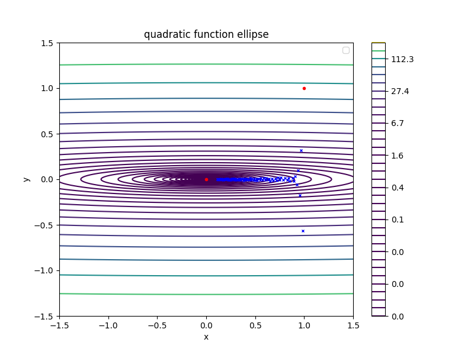
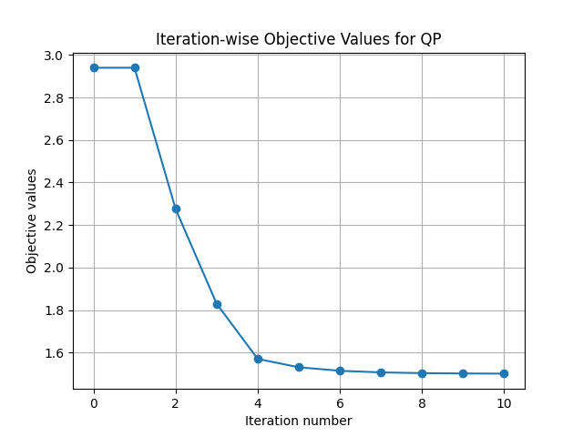
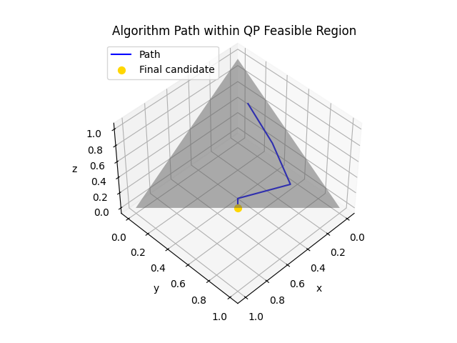

# Numerical Optimization of Unconstrained Functions

## Project Overview
This repository contains Python implementations of numerical optimization algorithms designed for unconstrained minimization problems. The primary focus is on Gradient Descent and Newton's Method, enhanced with robust line search techniques to determine optimal step sizes effectively.

## Repository Structure
- **src/**: Houses core modules that implement the optimization algorithms and auxiliary utility functions.
- **tests/**: Contains test scripts that apply the optimization techniques across various function scenarios and generate visual outputs for analysis.

## Installation and Usage
To get started with the optimization tests and view results:
1. Clone the repository:
   ```
   git clone https://github.com/maxmelichov/optimization-hw1.git
   ```
2. Execute the test script:
   ```
   python test_unconstrained_min.py
   ```

## Implemented Functions
The algorithms are rigorously tested on multiple function types, including quadratic forms and the Rosenbrock function. Descriptions and visual results for each scenario are outlined below:

### 1. Quadratic Function: Circle
Tests basic algorithm behavior on a simple quadratic function with circular level sets.
- **Output Visuals**:
  - 

  - 

### 2. Quadratic Function: Ellipse
Demonstrates the algorithms' performance on an elliptical quadratic function, emphasizing behavior on elongated level sets.
- **Output Visuals**:
  - 

  - 

### 3. Quadratic Function: Contour
Further explores optimization paths on various contour configurations.
- **Output Visuals**:
  - 

  - 

### 4. Quadratic Function: Boyd's
Focuses on a specialized Boyd’s quadratic function, testing edge cases in optimization.
- **Output Visuals**:
  - 

  - 

### 5. Rosenbrock Function
A classic optimization test function used to evaluate convergence properties of the methods.
- **Output Visuals**:
  - 

  - 

## Discussion
Newton's Method typically achieves faster convergence leveraging second-order information, albeit at the cost of higher computational demand and challenges with nearly singular Hessians. Gradient Descent, a first-order method, provides more consistent results across a broader range of conditions, though it may be slower, requiring more iterations for comparable precision.


Home work 2: 

Image 1: Iteration-wise Objective Values for LP
This graph shows the objective values at each iteration of a linear programming (LP) algorithm. The y-axis represents the objective value, and the x-axis shows the iteration number. The rapid decrease between iterations 3 and 4 suggests a significant improvement in the objective value, followed by stabilization, indicating that the algorithm has likely converged to an optimal solution.


Image 2: Algorithm Path within LP Feasible Region
This plot displays the path taken by the algorithm within the feasible region of the LP problem. Various constraints (y = 0, y = 1, x = 2, y = -x + 1) define the feasible region. The graph traces the algorithm's progression from an initial point to the final candidate solution, visually representing how the algorithm navigates through the feasible space to optimize the objective function.


Image 3: Iteration-wise Objective Values for QP
Similar to the first image, this graph shows the objective values per iteration for a quadratic programming (QP) problem. The graph shows a continuous decrease in the objective value, indicating that the algorithm is effectively finding lower values of the objective function, moving towards the minimum.



Image 4: Algorithm Path within QP Feasible Region
This 3D plot illustrates the path of an optimization algorithm in a quadratic programming feasible region. The axes represent the variables of the QP problem (x, y, z), and the path is marked leading to the final candidate solution. This visualization helps in understanding how the algorithm explores the multidimensional feasible space to arrive at an optimal solution.


