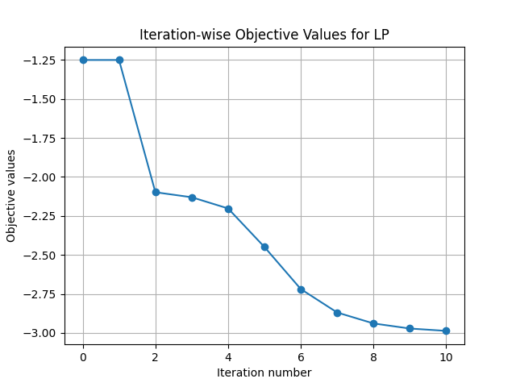
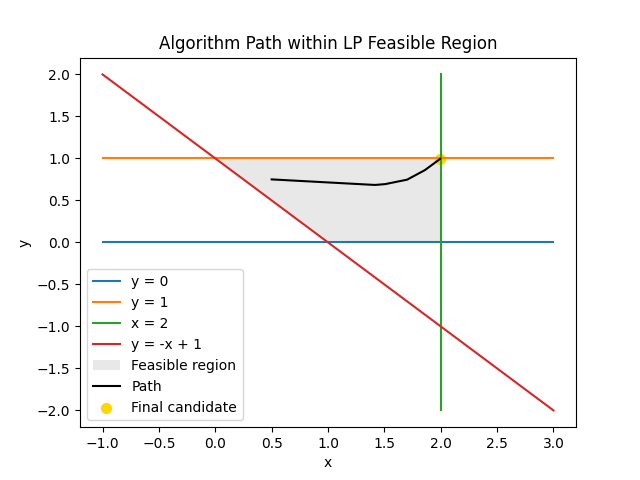

# Numerical Optimization of Unconstrained Functions

## Project Overview
This repository contains Python implementations of numerical optimization algorithms designed for unconstrained minimization problems. The primary focus is on Gradient Descent and Newton's Method, enhanced with robust line search techniques to determine optimal step sizes effectively.

## Repository Structure
- **src/**: Houses core modules that implement the optimization algorithms and auxiliary utility functions.
- **tests/**: Contains test scripts that apply the optimization techniques across various function scenarios and generate visual outputs for analysis.

## Installation and Usage
To get started with the optimization tests and view results:
1. Clone the repository:
   ```
   git clone https://github.com/maxmelichov/optimization-hw1.git
   ```
2. Execute the test script:
   ```
   python test_unconstrained_min.py
   ```

## Implemented Functions
The algorithms are rigorously tested on multiple function types, including quadratic forms and the Rosenbrock function. Descriptions and visual results for each scenario are outlined below:

### 1. Quadratic Function: Circle
Tests basic algorithm behavior on a simple quadratic function with circular level sets.
- **Output Visuals**:
  - 

  - 

### 2. Quadratic Function: Ellipse
Demonstrates the algorithms' performance on an elliptical quadratic function, emphasizing behavior on elongated level sets.
- **Output Visuals**:
  - 

  - 

### 3. Quadratic Function: Contour
Further explores optimization paths on various contour configurations.
- **Output Visuals**:
  - 

  - 

### 4. Quadratic Function: Boyd's
Focuses on a specialized Boyd’s quadratic function, testing edge cases in optimization.
- **Output Visuals**:
  - 

  - 

### 5. Rosenbrock Function
A classic optimization test function used to evaluate convergence properties of the methods.
- **Output Visuals**:
  - 

  - 

## Discussion
Newton's Method typically achieves faster convergence by leveraging second-order information, albeit at the cost of higher computational demand and challenges with nearly singular Hessians. Gradient Descent, a first-order method, provides more consistent results across a broader range of conditions, though it may be slower, requiring more iterations for comparable precision.


# Homework 2: 

## Linear Programming (LP):
Iteration-wise Objective Values:

The graph shows a significant decrease in the objective values of the LP problem over iterations, starting at approximately -1.25 and steadily dropping to around -3.0 by the tenth iteration. This indicates an effective minimization process.

### Algorithm Path within LP Feasible Region:
The feasible region is defined by various linear constraints, with the algorithm's path displayed as a black line converging towards the final candidate, highlighted by a yellow dot. This path suggests a careful navigation through the constraints to arrive at an optimal or near-optimal solution.
The final candidate position is roughly at coordinates (1.99, 0.99).
The objective function value at the final candidate is approximately -2.99.
The inequality constraints at this point are satisfactorily close to zero, showing adherence to the boundaries defined by the problem.





## Quadratic Programming (QP):
Iteration-wise Objective Values:

Similar to the LP graph, this plot shows a swift and significant decrease from around 2.8 to just above 1.6. The smooth decline suggests the quadratic objective function is being minimized effectively.

### Algorithm Path within QP Feasible Region:
This plot is in three dimensions reflecting the complex nature of the QP feasible region. The blue path marks the algorithm’s journey, which explores the region before settling at the final candidate position, denoted by a yellow dot.
The final candidate coordinates are roughly (0.50, 0.50, 0.001).
The objective function value at this point is about 1.50.
Both the inequality and equality constraints are very close to being satisfied at the solution point, indicating that the solution is feasible under the problem's requirements.


